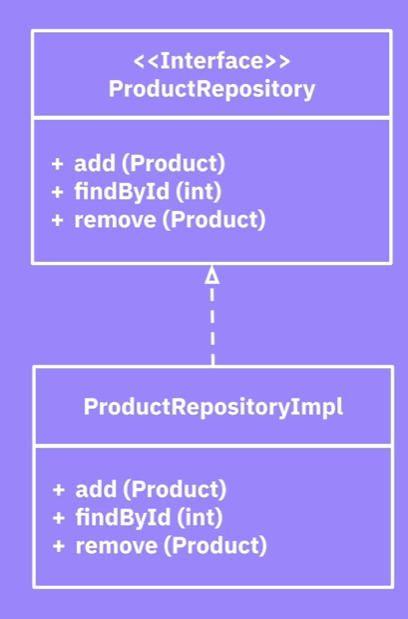
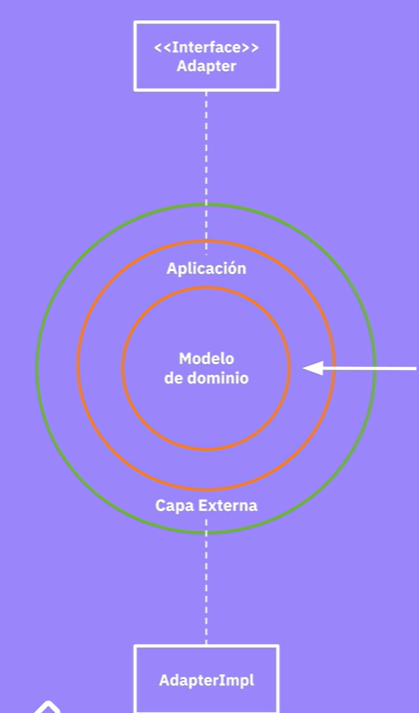

### **¿Qué sentido tiene sacar la base de datos a la infraestructura?**
- Migrar base de datos es una una excepción mas que la regla, asi que no es la mejor razón
- No es la única fuente de datos, ejemplo:
    - base de datos de legado
    - Archivos
    - Sistema de terceros (CRM, ERP)
    - Motores de busqueda (Elastichsearch, Algolia)
- Necesitas probar bien   

### **¿Como separar el dominio del acceso a datos?**

Una forma de separar es usando **el patron repository**.

- Ofrese una fachada que da la apariencia de estar usando colecciones (conjunto de objetos, se hace crud de objetos)
- Esconde los detalles especificos de como funciona la persistencia
- La forma de lograrlo a través de la inyección de dependencias

Ejemplo de patron repository:

Como implementarlo

[Código de ejemplo](https://github.com/manuelzapata/clean-architecture-example/tree/main)